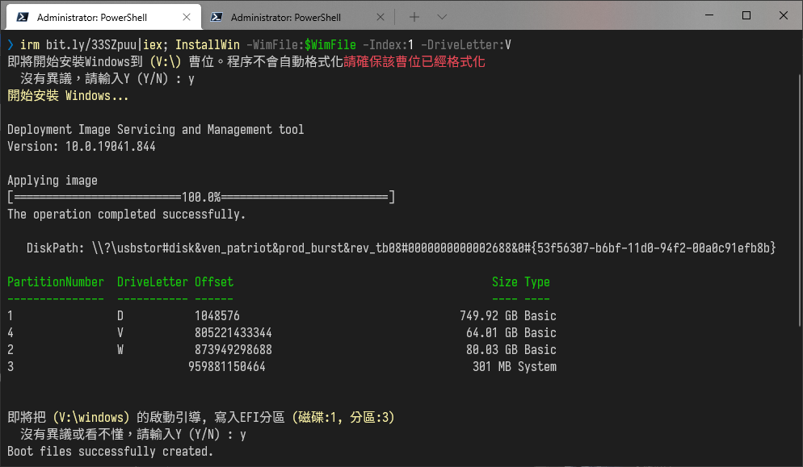

# 安裝Windows


## 壓縮磁碟機
```
# 從D曹壓縮64G，並新增E曹
irm bit.ly/33SZpuu|iex; CompressPartition -src:D -dst:E -Size:64GB
```

## 查看映像檔資訊
```
# 查看 ISO 映像檔資訊
$IsoFile = "D:\DATA\ISO_Files\Win11_Chinese(Traditional)_x64v1.iso"
irm bit.ly/33SZpuu|iex; Get-WIM_INFO -IsoFile:$IsoFile
irm bit.ly/33SZpuu|iex; Get-WIM_INFO -IsoFile:$IsoFile -Index:1

# 查看 WIM 映像檔資訊
$WimFile = "D:\DATA\ISO_Files\install.wim"
irm bit.ly/33SZpuu|iex; Get-WIM_INFO -WimFile:$WimFile
irm bit.ly/33SZpuu|iex; Get-WIM_INFO -WimFile:$WimFile -Index:1
```

## 安裝Windows
```
# 從 ISO 檔案安裝
$IsoFile = "D:\DATA\ISO_Files\Win11_Chinese(Traditional)_x64v1.iso"
irm bit.ly/33SZpuu|iex; InstallWin -IsoFile:$IsoFile -Index:1 -DriveLetter:V
# 從 Wim 檔案安裝
$WimFile = "D:\DATA\ISO_Files\install.wim"
irm bit.ly/33SZpuu|iex; InstallWin -WimFile:$WimFile -Index:1 -DriveLetter:V

# 修復引導(不小心打錯中斷了的話)
# autoFixEFI -DriveLetter:V
```